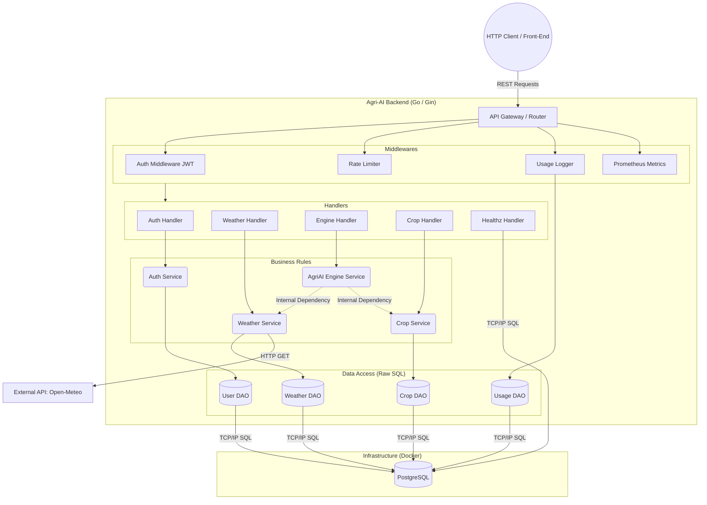

# SOA-GS2 | Agri-AI API - Architectural Document

### Group SOA-GS2

| Name | RM |
|:----:|:----:|
| Matheus Zottis | 94119 |
| Victor Didoff | 552965 |
| Vinicius Silva | 553240 |

## 1. Overview
The Agri-AI API is a Service-Oriented Architecture (SOA) backend platform developed in Go (Golang). Using the Gin framework and a PostgreSQL database, the system provides an intelligence engine capable of cross-referencing real-time meteorological data to recommend ideal agricultural crops and analyze climate risks. The API is containerized (Docker), adopts mature observability practices (Prometheus, JSON Logs), and uses strict error handling (RFC 7807).

## 2. Problem Addressed (SDG 9 Alignment)
Aligned with SDG 9 (Industry, Innovation and Infrastructure), the platform solves the lack of access to fast agrometeorological analysis for small and medium-sized producers.
The agricultural ecosystem suffers annually from unpredictable climate changes (sudden frosts, severe droughts). Agri-AI mitigates this problem by offering a predictive digital infrastructure, allowing producers to make data-driven decisions about what to plant and when to protect crops from extreme events.

## 3. Technologies Used
- Core Language: Go (Golang) 1.22+
- Web Framework: Gin Gonic
- Database: PostgreSQL
- Data Access: database/sql (DAO pattern) with pgx driver
- Database Migrations: golang-migrate
- Containerization: Docker and Docker Compose
- Security: JWT (JSON Web Tokens) and ulule/limiter (Rate Limiting)
- Observability: Prometheus (gin-prometheus) and log/slog (JSON Structured Logs)
- Documentation: Swagger (swaggo)

---

## 4. Architecture

The diagram below illustrates the logical isolation layers (Controllers, Services, DAOs) of the application, as well as its external dependencies:



### 4.1 Communication Between Services
The project applies the Dependency Injection (DI) pattern through native Go Interfaces.
- Internal Communication: Communication between domains (e.g., Engine talking to Weather) does not require HTTP requests over the network. They communicate directly and efficiently via memory allocation (interface method calls), maintaining high performance.
- External Communication: Done strictly via REST/HTTP requests, consuming public endpoints (Open-Meteo) using net/http and returning data to clients also via JSON over HTTP.

---

## 5. Solution Flow
1. Authentication: The user registers and logs in (`/api/v1/auth/login`), receiving a signed JWT token.
2. Validation: When requesting a Climate Risk Analysis, the request passes through Middlewares that validate the JWT signature, count the access limit (Rate Limit), and log the request in the DB for auditing.
3. Orchestration: The Engine Handler receives the coordinates (lat/lon) and triggers the Engine Service.
4. Resilience: The Engine requests weather data from the Weather Service, which first checks PostgreSQL (Cache). If there is no recent cache, the service fetches it from the external API (Open-Meteo).
5. Processing: The Engine cross-references the climate metrics with the crop threshold heuristics (fetched by the Crop DAO).
6. Response: The analysis result is consolidated and returned in JSON format (Problem Details in case of error) to the client.

---

## 6. Main Endpoints

### Authentication and Health
- POST `/api/v1/auth/register` - Registers a new user.
- POST `/api/v1/auth/login` - Authenticates a user and returns the JWT token.
- GET `/api/v1/healthz` - Liveness probe, validates uptime and PostgreSQL ping.
- GET `/metrics` - Standard Prometheus endpoint exposing Go app usage and telemetry.

### Public Domain / Read-only (Protected routes via JWT)
- GET `/api/v1/protected/crops` - Lists all crops and their heuristics supported by the system.
- GET `/api/v1/protected/weather` - Queries the current weather for a specific coordinate (lat/lon).
- GET `/api/v1/protected/weather/cache` - Lists the cached history of weather forecasts.

### Intelligence and Processing (Protected routes via JWT)
- GET `/api/v1/protected/engine/risk-analysis` - Calculates the imminent climate risk (frosts, droughts, extreme winds) based on a coordinate.
- GET `/api/v1/protected/engine/crop-selector` - Recommends, on a percentage basis, which cataloged crops are viable for planting in a given region.
- GET `/api/v1/protected/engine/harvest` - Calculates the best harvesting period for a crop based on the weather.

---

## 7. Security Strategy
- Access Control: JWT (JSON Web Tokens) with restricted validity signed via HMAC secret key (HS256). No `/protected/` route is accessible without a valid token in the `Authorization: Bearer <token>` header.
- Attack Prevention (DDoS): Implemented a native Rate Limit Middleware (`ulule/limiter`), restricting each user to 10 requests per minute, preventing computational abuse.
- SQL Injection Prevention: All database access uses Go's native `database/sql` library, which utilizes bind parameters / prepared statements, such as `($1, $2)`, completely blocking SQL Injection vectors.
- Transparent Auditing: A Middleware intercepts successful routes and consolidates in the database (`api_usage_logs` table) everything that users have queried.

---

## 8. Scalability and Resilience Vision
The application was born ready for Cloud architectures, designed according to the 12-Factor App methodology:
- Stateless: The Go API does not store state on disk or in long-term memory. All sessions (JWT) and data reside in the database or in headers. This allows for horizontal scaling, spinning up 10, 50, or 100 API container replicas in a Kubernetes cluster behind a Load Balancer without server conflicts.
- Total Observability: Features a Structured Logging format (`log/slog` emitting JSON) ideal for tools like ElasticSearch or Datadog, in addition to a native `/metrics` route scrapable via Prometheus (exposing GC, memory, and HTTP traffic).
- Liveness and Readiness Probes: Smart `/healthz` route actively evaluates the database TCP pool and not just the API "Uptime", preventing the orchestrator (Docker Swarm/K8s) from sending traffic to a Pod that has lost connection to PostgreSQL.
- Third-party Fault Tolerance: The implementation of Caching for Open-Meteo saves network bandwidth, reduces latency, and prevents Engine failures in case the weather provider is temporarily unavailable. Error responses always return standardized via RFC 7807 (Problem Details).

---

## 9. CI/CD and Code Quality (GitHub Actions)
The application has a Continuous Integration (CI) pipeline running via **GitHub Actions** (`.github/workflows/ci.yml`).
On every *push* or *pull_request* to the `main` branch, the following steps are automatically validated:
- **Unit Tests:** Validation of isolated logic, such as JWT key HMAC signature in the Auth package.
- **End-to-End (E2E) Tests:** Integration tests (with `httptest`) that spin up the Gin router and validate route responses, such as the `/healthz` probe.
- **Gosec Security Scanner:** Static AST source code audit looking for exposed keys, *SQL injection*, or logic flaws (*Unhandled errors*).
A *merge* is only possible if all tests pass (green coverage).

---

## 10. Execution Instructions

Requirements: Have `Docker` and `docker-compose` installed on the machine.

1. Open the terminal and navigate to the project's root directory (where the `docker-compose.yml` file is located).
2. Run the command to build and spin up the containers in the background:
   ```bash
   docker-compose up --build -d
   ```
3. Wait about 10 seconds. The migration container will automatically create the tables in PostgreSQL and seed them with Crops.
4. The base API will be available at `http://localhost:8080/api/v1`.
5. Interact with the Endpoints and test the platform by visiting the Swagger visual interface:
	```text
	http://localhost:8080/swagger/index.html
	```

---

## 11. Project Structure (File Tree)

```text
SOA-GS2/
├── cmd/
│   ├── loadtest/
│   └── server/          # Main entrypoint (main.go)
├── docs/                # Swagger auto-generated documentation
├── internal/            # Application restricted source code
│   ├── auth/            # Hash and password rules
│   ├── dao/             # Data Access Objects (SQL)
│   ├── handlers/        # HTTP Controllers (Gin)
│   ├── middleware/      # Interceptors (Auth, Rate Limit, Logs)
│   ├── models/          # Entities and Data structs
│   └── services/        # Business Rules (Engine, Weather, etc)
├── migrations/          # DB versioning SQL scripts
├── docker-compose.yml   # Container orchestration
├── Dockerfile           # Optimized (Multi-stage) backend image
├── go.mod               # Dependency management
├── go.sum
├── Makefile             # Useful development commands
└── README.md            # Architectural Document
```
