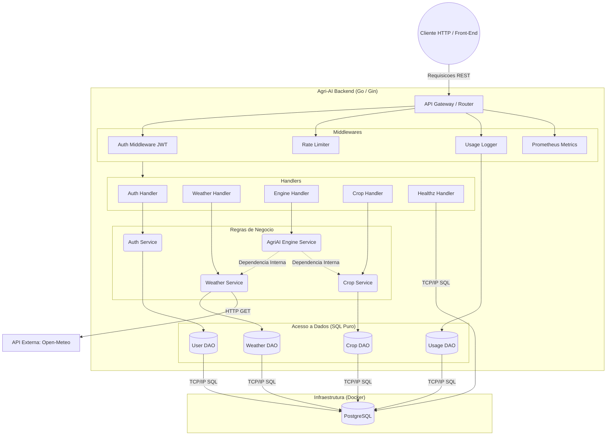

# SOA-GS2 | Agri-AI API - Documento Arquitetural

### Grupo SOA-GS2

| Name | RM |
|:----:|:----:|
| Matheus Zottis | 94119 |
| Victor Didoff | 552965 |
| Vinicius Silva | 553240 |

## 1. Visao Geral
A Agri-AI API e uma plataforma backend orientada a servicos (SOA) desenvolvida em Go (Golang). Utilizando o framework Gin e o banco de dados PostgreSQL, o sistema fornece um motor de inteligencia capaz de cruzar dados meteorologicos em tempo real para recomendar culturas agricolas ideais e analisar riscos climaticos. A API e conteinerizada (Docker), adota praticas maduras de observabilidade (Prometheus, JSON Logs) e tratamento rigoroso de erros (RFC 7807).

## 2. Problema Abordado (Alinhamento ODS 9)
Alinhada ao ODS 9 (Industria, Inovacao e Infraestrutura), a plataforma resolve a falta de acesso a analises agrometeorologicas rapidas para pequenos e medios produtores.
O ecossistema agricola sofre anualmente com mudancas climaticas imprevisiveis (geadas repentinas, secas severas). A Agri-AI mitiga esse problema oferecendo infraestrutura digital preditiva, permitindo que o produtor tome decisoes baseadas em dados sobre o que plantar e quando proteger a lavoura de eventos extremos.

## 3. Tecnologias Utilizadas
- Linguagem Base: Go (Golang) 1.22+
- Web Framework: Gin Gonic
- Banco de Dados: PostgreSQL
- Acesso a Dados: database/sql (padrao DAO) com driver pgx
- Migracoes de Banco: golang-migrate
- Containerizacao: Docker e Docker Compose
- Seguranca: JWT (JSON Web Tokens) e ulule/limiter (Rate Limiting)
- Observabilidade: Prometheus (gin-prometheus) e log/slog (Logs Estruturados JSON)
- Documentacao: Swagger (swaggo)

---

## 4. Arquitetura

O diagrama abaixo ilustra as camadas de isolamento logico (Controllers, Services, DAOs) da aplicacao, bem como suas dependencias externas:



### 4.1 Comunicacao Entre Servicos
O projeto aplica o padrao de Injecao de Dependencias (DI) atraves de Interfaces nativas do Go.
- Comunicacao Interna: A comunicacao entre os dominios (Ex: Engine conversando com Weather) nao exige requisicoes HTTP em rede. Eles comunicam-se de forma direta e eficiente via alocacao de memoria (chamadas de metodo de interface), mantendo alta performance.
- Comunicacao Externa: Feita estritamente via requisicoes REST/HTTP, consumindo endpoints publicos (Open-Meteo) com net/http e retornando dados aos clientes tambem via JSON sobre HTTP.

---

## 5. Fluxo da Solucao
1. Autenticacao: O usuario se registra e faz login (`/api/v1/auth/login`), recebendo um token JWT assinado.
2. Validacao: Ao solicitar uma Analise de Risco Climatico, a requisicao passa pelos Middlewares que validam a assinatura do JWT, contam o limite de acessos (Rate Limit) e logam a requisicao no DB para auditoria.
3. Orquestracao: O Engine Handler recebe as coordenadas (lat/lon) e aciona o Engine Service.
4. Resiliencia: O Motor pede dados do clima ao Weather Service, que primeiro verifica o PostgreSQL (Cache). Se nao houver cache recente, o servico busca na API externa (Open-Meteo).
5. Processamento: O Motor cruza as metricas de clima com as heuristicas de limite para as culturas (buscadas pelo Crop DAO).
6. Resposta: O resultado da analise e consolidado e retornado em formato JSON (Problem Details em caso de erro) para o cliente.

---

## 6. Endpoints Principais

### Autenticacao e Saude
- POST `/api/v1/auth/register` - Registra um novo usuario.
- POST `/api/v1/auth/login` - Autentica um usuario e retorna o token JWT.
- GET `/api/v1/healthz` - Liveness probe, valida o uptime e o ping com o PostgreSQL.
- GET `/metrics` - Endpoint padrao do Prometheus expondo o uso e telemetria do app Go.

### Dominio Publico / Leitura (Rotas Protegidas via JWT)
- GET `/api/v1/protected/crops` - Lista todas as culturas e suas heuristicas suportadas pelo sistema.
- GET `/api/v1/protected/weather` - Consulta a meteorologia atual para uma coordenada especifica (lat/lon).
- GET `/api/v1/protected/weather/cache` - Lista o historico salvo em cache das previsoes de tempo.

### Inteligencia e Processamento (Rotas Protegidas via JWT)
- GET `/api/v1/protected/engine/risk-analysis` - Calcula o risco climatico iminente (geadas, secas, ventos extremos) baseado numa coordenada.
- GET `/api/v1/protected/engine/crop-selector` - Recomenda, em base percentual, quais culturas catalogadas sao viaveis para plantio numa determinada regiao.
- GET `/api/v1/protected/engine/harvest` - Calcula o melhor periodo de colheita para uma cultura baseada no clima.

---

## 7. Estrategia de Seguranca
- Controle de Acesso: Tokens JWT (JSON Web Tokens) com validade restrita assinados via chave secreta HMAC (HS256). Nenhuma rota `/protected/` e acessivel sem um token valido no cabecalho `Authorization: Bearer <token>`.
- Prevencao de Ataques (DDoS): Implementado um Middleware nativo de Rate Limit (`ulule/limiter`), restringindo cada usuario a 10 requisicoes por minuto, evitando abusos computacionais.
- Prevencao de Injecao de SQL: Todo e qualquer acesso ao banco de dados utiliza a biblioteca `database/sql` nativa do Go, que utiliza parametros associados (bind parameters / prepared statements), como `($1, $2)`, bloqueando completamente vetores de SQL Injection.
- Auditoria Transparente: Um Middleware intercepta as rotas de sucesso e consolida no banco (tabela `api_usage_logs`) tudo o que os usuarios consultaram.

---

## 8. Visao de Escalabilidade e Resiliencia
A aplicacao ja nasceu preparada para arquiteturas em Nuvem, desenhada aos moldes do 12-Factor App:
- Stateless: A API Go nao armazena estado em disco nem em memoria de longa duracao. Todas as sessoes (JWT) e dados residem no banco ou nos headers. Isso permite escalar horizontalmente subindo 10, 50 ou 100 replicas do container da API num Kubernetes atras de um Load Balancer sem que os servidores entrem em conflito.
- Observabilidade Total: Conta com formato de Logging Estruturado (`log/slog` emitindo JSON) ideal para ferramentas como ElasticSearch ou Datadog, alem de uma rota nativa `/metrics` raspavel via Prometheus (expondo GC, memoria e trafego HTTP).
- Liveness e Readiness Probes: Rota inteligente `/healthz` avalia o pool TCP do banco de dados ativamente e nao apenas o "Uptime" da API, impedindo que o orquestrador (Docker Swarm/K8s) envie trafego para um Pod que perdeu conexao com o PostgreSQL.
- Tolerancia a Falhas em Terceiros: A implementacao de Caching para a Open-Meteo poupa banda de rede, reduz a latencia e previne falhas na Engine caso o provedor meteorologico fique temporariamente fora do ar. As respostas de erro sempre voltam padronizadas via RFC 7807 (Problem Details).

---

## 9. CI/CD e Qualidade de Código (GitHub Actions)
A aplicação conta com uma esteira de Integração Contínua (CI) operando via **GitHub Actions** (`.github/workflows/ci.yml`).
A cada *push* ou *pull_request* para a branch `main`, as seguintes etapas são validadas automaticamente:
- **Testes Unitários:** Validação de lógicas isoladas, como a assinatura HMAC de chaves JWT no pacote de Auth.
- **Testes End-to-End (E2E):** Testes de integração (com `httptest`) que sobem o roteador Gin e validam respostas de rotas, como a sonda `/healthz`.
- **Gosec Security Scanner:** Auditoria estática de código-fonte AST em busca de chaves expostas, *SQL injection* ou falhas lógicas (*Unhandled errors*).
Só é possível realizar um *merge* caso todos os testes passem (cobertura verde).

---

## 10. Instrucoes de Execucao

Requisitos: Ter o `Docker` e o `docker-compose` instalados na maquina.

1. Abra o terminal e navegue ate o diretorio raiz do projeto (onde esta o arquivo `docker-compose.yml`).
2. Execute o comando para montar e subir os containers em segundo plano:
   ```bash
   docker-compose up --build -d
   ```
3. Aguarde cerca de 10 segundos. O container de migracao criara automaticamente as tabelas no PostgreSQL e as semeara com as Culturas.
4. A API base estara disponivel em `http://localhost:8080/api/v1`.
5. Interaja com os Endpoints e teste a plataforma visitando a interface visual do Swagger:
	```text
	http://localhost:8080/swagger/index.html
	```

---

## 11. Estrutura do Projeto (File Tree)

```text
SOA-GS2/
├── cmd/
│   ├── loadtest/
│   └── server/          # Entrypoint principal (main.go)
├── docs/                # Documentacao autogerada pelo Swagger
├── internal/            # Codigo fonte restrito a aplicacao
│   ├── auth/            # Regras de Hash e senhas
│   ├── dao/             # Data Access Objects (SQL)
│   ├── handlers/        # Controladores HTTP (Gin)
│   ├── middleware/      # Interceptadores (Auth, Rate Limit, Logs)
│   ├── models/          # Entidades e structs de Dados
│   └── services/        # Regras de Negocio (Engine, Weather, etc)
├── migrations/          # Scripts SQL de versionamento do BD
├── docker-compose.yml   # Orquestracao dos containers
├── Dockerfile           # Imagem otimizada (Multi-stage) do backend
├── go.mod               # Gerenciamento de dependencias
├── go.sum
├── Makefile             # Comandos uteis de desenvolvimento
└── README.md            # Documento Arquitetural
```
